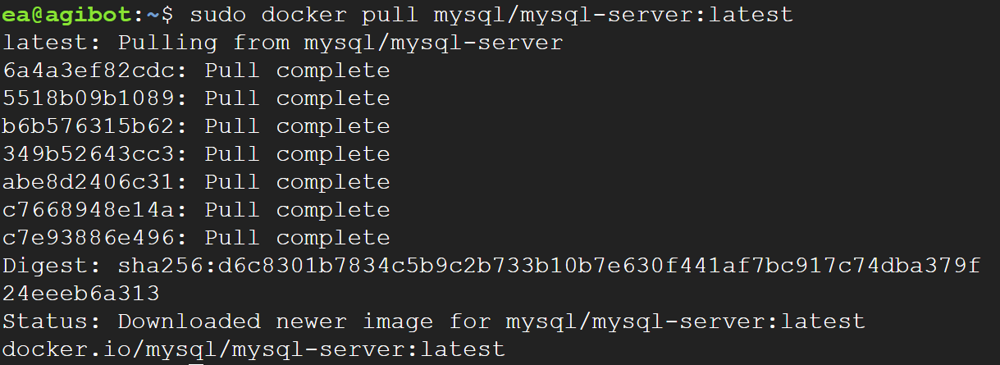
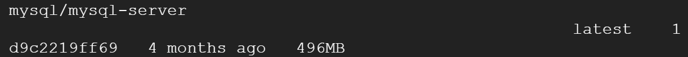
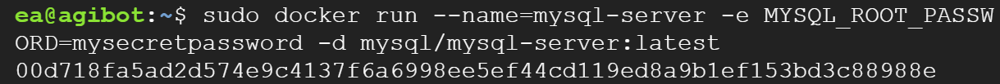
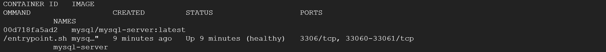
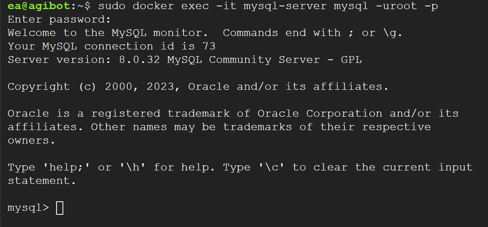
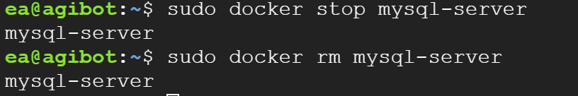
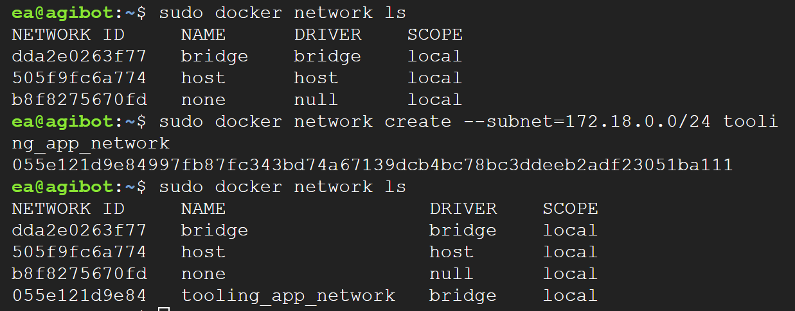

# Solution for Migrating to Docker Containerization


## Introduction
In this project, we will learn how to solve the challenges of deploying and managing multiple applications with varying requirements using Docker containers. Docker is a widely adopted containerization technology that allows us to package applications and their dependencies into isolated containers. By using Docker, we can ensure consistent deployment across different environments and easily scale our applications.

## Why Docker?
Docker provides several advantages over traditional virtual machines (VMs) for application deployment:

- <b>Efficiency</b>: Docker containers share the host system's OS kernel, resulting in lightweight and efficient resource utilization.
- <b>Portability</b>: Docker containers can be easily shipped and run on any system with Docker installed, ensuring consistent behavior across different environments.
- <b>Isolation</b>: Each Docker container provides a separate and isolated environment for applications, preventing conflicts between dependencies and allowing for better security.
- <b>Easy Management</b>: Docker provides a simple and unified interface for managing containers, allowing for easier provisioning, scaling, and monitoring of applications.

## Getting Started
Before starting the project, it is recommended to take a Docker course to gain theoretical knowledge and understand the basics of Docker. Once you have completed the course, you can proceed with the practical project.

## Installation and Preparation
- Install Docker Engine on your PC by following the instructions provided here.
Once Docker Engine is installed, you will have access to the Docker CLI (docker) and Docker daemon (dockerd).

## Migration from VM to Docker
In this project, we will migrate a web application called "Tooling" from a VM-based solution to a containerized one. The Tooling web application is a PHP-based solution with a MySQL database.

To begin the migration, we will start with the database layer and containerize the MySQL database.

## MySQL in a Container
Follow these steps to configure and deploy the MySQL container:

### Pull MySQL Docker Image
- Pull the appropriate Docker image for MySQL from the Docker Hub Registry. You can choose a specific version or use the latest release:

```bash
docker pull mysql/mysql-server:latest
```
result:




- You can check if the image has been successfully downloaded by listing the available images:

```bash
docker image ls
```
result:



### Deploy the MySQL Container
- Deploy a new MySQL container using the downloaded image. Provide a name for the container and set the root password for MySQL:

```bash
docker run --name <container_name> -e MYSQL_ROOT_PASSWORD=<my-secret-pw> -d mysql/mysql-server:latest
```

Replace <container_name> with the desired name for your container. If no name is provided, Docker will generate a random one. Replace <my-secret-pw> with your chosen password.

Result:



- Ensure that the MySQL container is running by checking its status:

```bash
docker ps -a
```

The output should display the newly created container with its status changing from "health: starting" to "healthy" once the setup is complete.

Result:



Note: The provided solution covers the initial steps of migrating to Docker containerization. For a complete migration and deployment process, further configuration and setup steps are required, such as containerizing the PHP application, networking, and orchestration.


## Connecting to the MYSQL Docker Container
We can connect directly to the container running the MySQL server or use a second container as a MySQL client. In this section, we will explore both options.

### Approach 1: 
Connecting directly to the MySQL server Container

```bash
docker exec -it mysql mysql -uroot -p
```
Note: Provide the root password when prompted. With that, you’ve connected the MySQL client to the server.

Finally, change the server root password to protect your database. Exit the the shell with exit command

<b>Flags used</b>:
- **exec** used to execute a command from bash itself
- **it** makes the execution interactive and allocate a pseudo-TTY
- **bash** this is a unix shell and its used as an entry-point to interact with our container
- **mysql** The second mysql in the command "docker exec -it mysql mysql -uroot -p" serves as the entry point to interact with mysql container just like bash or sh
- **-u** mysql username
- **-p** mysql password

result:


- Exit the MySQL shell with exit command:
    
    ```bash
    ctrl + p + q
    ```


### Approach 2:
Connecting to the MySQL server Container from a second Container

- At this stage you are now able to create a docker container but we will need to add a network. So, stop and remove the previous mysql docker container.
    
    ```bash
    sudo docker ps -a
    sudo docker stop mysql-server
    sudo docker rm mysql-server
    ```
    or 
    ```bash
    sudo docker rm <container ID>
    ```
Result:


- Create a network for the containers to communicate with each other:
    
    ```bash
    sudo docker network create --subnet=172.18.0.0/24 tooling_app_network
    ```

    **Note:**

    Creating a custom network is not necessary because even if we do not create a network, Docker will use the default network for all the containers you run. By default, the network we created above is of DRIVER Bridge. So, also, it is the default network. You can verify this by running the docker network ls command.

    But there are use cases where this is necessary. For example, if there is a requirement to control the cidr range of the containers running the entire application stack. This will be an ideal situation to create a network and specify the --subnet

    For clarity’s sake, we will create a network with a subnet dedicated for our project and use it for both MySQL and the application so that they can connect.

    Result:
    

### Run the MySQL Server container using the created network

- Let's create an environment variable to store the root password